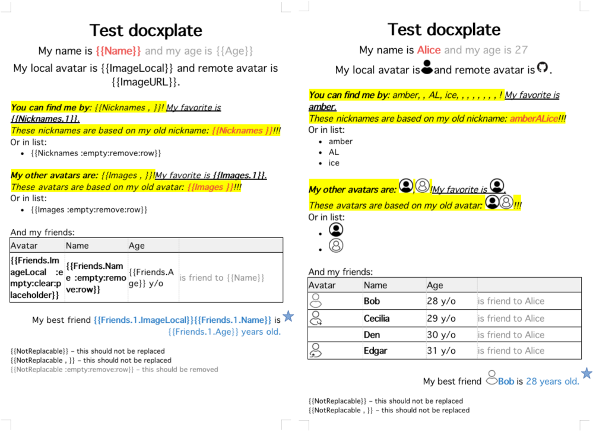

# docxplate [](https://github.com/bobiverse/docxplate/actions/workflows/go.yml)
Generate document from .docx template file.  
(!) **Unstable with complex/many levels Structs.**

## Examples
*Click on image to see larger.*
[](/images/preview.png)

```go
// Using this data for all examples below
type User struct {
	Name       string
	Age        int
	Nicknames  []string
	Friends    []*User
	ImageLocal *docxplate.Image
	ImageURL   *docxplate.Image
}

user := User{
	Name:      "Alice",
	Age:       27,
	Nicknames: []string{"amber", "AL", "ice"},
	Friends: []*User{
		&User{Name: "Bob", Age: 28},
		&User{Name: "Cecilia", Age: 29},
		&User{Name: "Den", Age: 30},
	},
	ImageLocal: &docxplate.Image{
		Path:   "images/github.png",
		Width:  50,
		Height: 50,
	},
	ImageURL: &docxplate.Image{
		URL:    "https://github.githubassets.com/images/modules/logos_page/GitHub-Mark.png",
		Width:  50,
		Height: 50,
	},
}

// Template to document
tdoc, _ := docxplate.OpenTemplate("template.docx")
tdoc.Params(user)
tdoc.ExportDocx("MyDoc.docx")
```

### Struct as data input
`Hello, {{Name}}!` --> `Hello, Alice!`  
`You are {{Age}} years old.` --> `You are 27 years old.`

### Slice/Map placeholder to multiple rows

    Here is my nicknames:
    - {{Nicknames}}    
    ---------------------------------------------------
    Here is my nicknames:
    - amber
    - AL
    - ice

List slice structs expands to multiple rows:

    My Friends:
        * {{Friends.Name}} is {{Friends.Age}} years old
    ---------------------------------------------------
    My Friends:
        * Bob is 28 years old
        * Cecilia is 29 years old
        * Den is 30 years old

### Slice/Map placeholder to implode multiple values
Use `{{Nicknames ***}}` to concatenate values with given separator: `amber***AL***ice`.  
Or no separator at all `{{Nicknames }}` (still one space required to mark placeholder as inline values): `amberALice`.  

    Here is my nicknames: {{Nicknames , }} :)
    ---------------------------------------------------
    Here is my nicknames: amber, AL, ice :)


## Bugs
Don't use too complicated struct.  
Above exmaple with `User->Friends->User` is limit in depth.  
`{{User->Friends->User->Friends}}` is not supported at this moment.


## Examples
